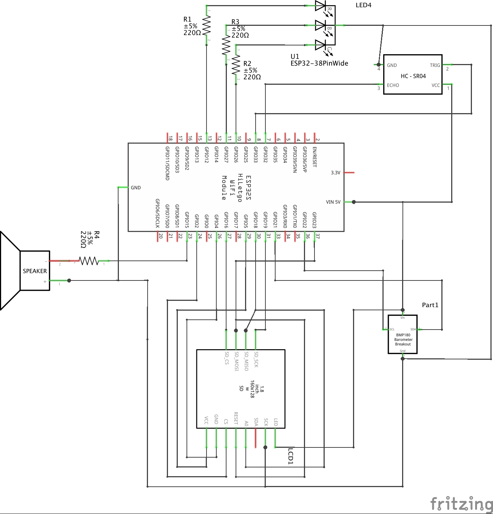

# BrickClock
An ESP32-Arduino simple alarm clock with some weather monitoring features.

##  Description
Some key points about the project:
* BrickClock is a simple alarm clock plus temperature, pressure and humidity monitoring
* The name comes from the fact that I personally used a big Lego brick as a case
* A WiFi connection is required to operate
* It has a BMP280 sensor to collect indoor data whereas use the [OpenWeather API](https://openweathermap.org) to get outdoor data;  
Maybe in the future I'll use another sensor to collect external temperature and humidity... we'll see
* It use a HR-SR04 ultrasonic sensor as a unique, sleepiness-proof, interface with the user: roughly put your hand in front of the clock to stop the alarm sound or change the view.
* All the settings are made through the exposed web page
* The collected data is saved inside an SD card
* A simple chart of pressure and outdoor temperature is shown on the display
* A more complex chart including humidity and both indoor and outdoor data is accessible through the exposed web page
* There is a RGB Led on the back that can be configured to change color by time
* The alarm can be scheduled by week days and the melody is a nerdy Start Wars theme (I'm planning to make it customizable)

## Parts list
* ESP32 - 38 pin variant - [Amazon](https://amzn.to/39W4oeO)
* ST7735S - TFT Display 160x128 with SD card reader - [Amazon](https://amzn.to/36MLlBF) - [Amazon (alternative)](https://amzn.to/2YSLvTq)
* HC-SR04 Ultrasonic Distance Sensor - [Amazon](https://amzn.to/3aDzEOF)
* RGB LED (com. cathode, rbg) - [Amazon](https://amzn.to/3aH53Qe)
* BMP180 - Barometric Pressure Sensor - [Amazon](https://amzn.to/2YNMeFy)
* 4 X 220Ω Resistor - [Amazon (220Ω)](https://amzn.to/39Rsebt) - [Amazon (assorted)](https://amzn.to/3oVvqa4)
* Speaker - I usually salvage it from old toys - [Banggood](https://www.banggood.com/Wltoys-16800-1-or-16-RC-Excavator-Spare-Horn-Speaker-1448-Car-Vehicles-Model-Parts-p-1802502.html?cur_warehouse=CN&rmmds=search)

Of course you will also need common prototyping tools:
* Large Breadboard - [Amazon](https://amzn.to/2Oe4t55)
* Jumper Wires - [Amazon](https://amzn.to/3cLZORT)

And if you are going to solder everything in something permanent:
* A soldering kit - [Amazon](https://amzn.to/3twp3O8)
* Perfboards - [Amazon](https://amzn.to/39Vw7Mu)

## Libraries required
* [Adafruit_BME280_Library](https://github.com/adafruit/Adafruit_BME280_Library)
* [Adafruit_Unified_Sensor](https://github.com/adafruit/Adafruit_Sensor)
* [ArduinoJson](https://github.com/bblanchon/ArduinoJson)
* [AsyncTCP](https://github.com/me-no-dev/AsyncTCP)
* [ESPAsyncTCP](https://github.com/me-no-dev/ESPAsyncTCP)
* [ESPAsyncWebServer](https://github.com/me-no-dev/ESPAsyncWebServer)
* [TFT_eSPI](https://github.com/Bodmer/TFT_eSPI)
* [melody-player](https://github.com/fabiuz7/melody-player-arduino)

## Breadboard

## Schematics

## Useful links
* [Arduino IDE](https://www.arduino.cc/en/software)
* [ESP32 Board for Arduino](https://github.com/espressif/arduino-esp32/blob/master/docs/arduino-ide/boards_manager.md)
* [VS Code](https://code.visualstudio.com)
* [VS Code Arduino Extension](https://marketplace.visualstudio.com/items?itemName=vsciot-vscode.vscode-arduino)
* [ArduinoJSON Assistant](https://arduinojson.org/v6/assistant/): the tool used to compute json buffer size
* [Fritzing download](https://github.com/fritzing/fritzing-app/releases)

## To Do
* try to reduce json payload size
* check if it is possible to not use additional buffer in json serialization
* better naming in the configuration struct
* remove all Serial print if not in in debug
* make the alarm melody editable
* investigate and filter out [abnormal](https://www.youtube.com/watch?v=C9Pw0xX4DXI) sensor reading